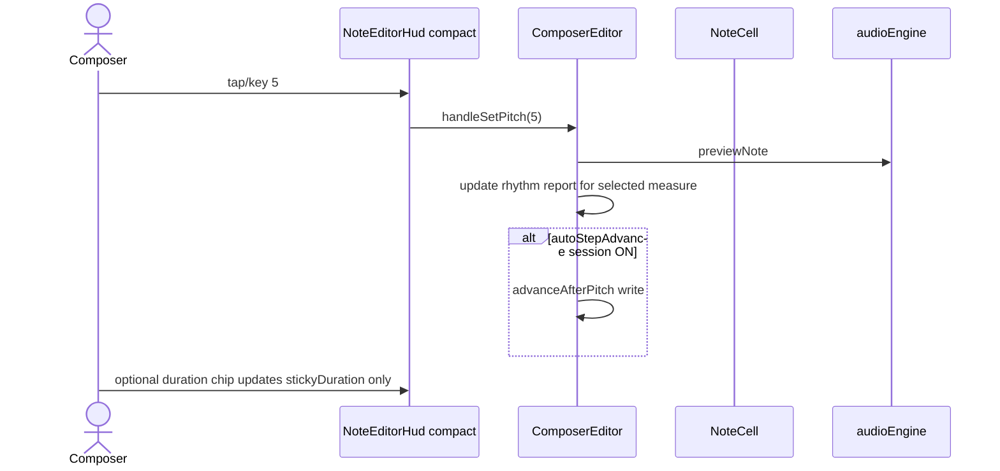
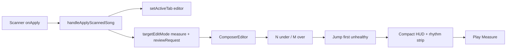
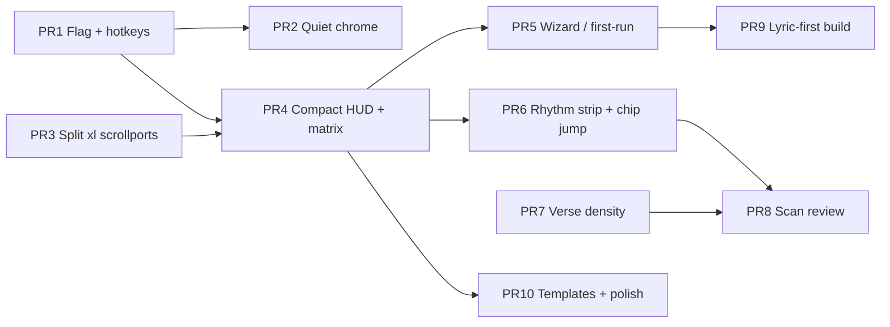

# Composer GUI & Workflow Enhancement Plan

| Field | Value |
| --- | --- |
| **Document** | Composer GUI & Workflow Enhancement Plan |
| **Product** | Taigi Composer (`taigi-composer`) |
| **Author** | TBD |
| **Date** | 2026-09-05 |
| **Status** | Reviewed (ready for product owner review) |
| **Audience** | Senior engineers and product owner reviewing an incremental UX plan (no code in this PR) |

---

## Overview

Taigi Composer is a client-side Next.js 15 PWA for composing Taiwanese Hokkien (Tâi-gí) songs in numbered musical notation (簡譜), with aligned POJ (白話字) and Hàn-lô (漢羅) lyrics, karaoke playback, and Gemini score scanning. The composing surface is already capable: verse/measure dual views, a dense in-card HUD, rhythm reports, lyric aligner, measure organizer, undo history, and iPad-conscious touch targets. The problem is not missing features. It is **cognitive load**: too many always-on controls, overlapping entry points, a first-run that dumps the user into a finished preset in Split View, a note-entry loop that is “select → hunt through HUD tabs → maybe advance,” and a keyboard map that the header advertises incompletely and that the editor and shell implement inconsistently.

This plan proposes a **progressive composing workflow**: a guided first-song path and a quieter default chrome, while preserving the existing amber DAW visual language, numbered notation as the primary editor, and the full power-user density behind contextual panels. Delivery is a sequence of independently shippable PRs, not a visual rewrite.

The compose loop is specified as an **end-of-bar matrix** (under → insert a rest placeholder in bar; full + next measure exists → select it; full + last measure + filling a compose slot → append a rest-placeholder bar; overwriting an already-sounding 1–7 in a full last bar → do not grow; over → do not append). The compact HUD has a **layout contract** (one overflow-hidden flex column, only the score scroller scrolls, `100svh`, HUD `flex-none` with safe-area padding — not `position: fixed` / `bottom:`). One chrome flag (`quiet` | `classic`) ships in the first PR so every later chrome/HUD change is reversible. Onboarding migrates existing `taigi_composer_current_song` so the picker cannot overwrite returning users.

---

## Background & Motivation

### Current state (verified in code)

The app is a single client page (`app/page.tsx`) with three persisted view tabs (`karaoke` | `editor` | `split`). Default tab is **Split** (`getStoredActiveTab()` in `lib/storage.ts` returns `'split'`). On first load the song is `PRESET_SONGS[0]` — 雨夜花 (`lib/presets.ts`) — unless a previous song exists in `localStorage` key `taigi_composer_current_song`.

Important persistence detail: `useSongHistory(PRESET_SONGS[0])` always starts as 雨夜花, and `app/page.tsx` (~122–126) **writes `setStoredCurrentSong(song)` on every song change, including first paint**. After one mount, `taigi_composer_current_song` exists and is the preset. The load effect (~81–86) only replaces state if the saved song **differs** from the preset, so a returning visitor who never composed still looks like “first visit with 雨夜花 already loaded.”

Composing is orchestrated by `ComposerEditor` (`components/ComposerEditor.tsx`, 2444 lines). It owns:

- Edit mode (`verse` default, persisted via `taigi_composer_editor_edit_mode`)
- Selection coords `[measureIndex, noteIndex]`
- Auto-step-advance (persisted global boolean `taigi_composer_auto_step_advance`, **defaults `false`**)
- Unhealthy-measure count via `!getMeasureRhythmReport(...).isFull` (under **and** over beat)
- Measure multi-select and duration batch ops
- Jump-to-measure from karaoke (`targetMeasureIndex`)
- A window-level composing keymap

The HUD (`components/composer/NoteEditorHud.tsx`, 1691 lines) is rendered **in-card** (`inCard={true}`) under the selected verse (`VerseModeView` ~line 819) or measure (`MeasureModeView` ~line 943). Tabs: `numpad` (Quick Bar) | `piano` | `ornaments` | `lyrics`. **Tab** is persisted (`STORAGE_KEYS.DECK_TAB` / `getStoredDeckTab()`). **Collapse** is local React state, not persisted.

When `inCard={false}`, the HUD class is `sticky top-[68px]` — a **top** bar under the header, unused today. `ComposerEditor` still imports `NoteEditorHud` but does not render it (dead import). Root still pads `pb-36 sm:pb-52` as leftover empty space.

Persistence is localStorage only (`lib/storage.ts`). History is a 60-step in-memory stack (`hooks/useSongHistory.ts`). There is no backend user account. Gemini features already exist (`lib/geminiAuth.ts`, `components/AiScoreScannerModal.tsx`, `components/QuickLyricAlignerModal.tsx`).

### Pain points diagnosed from the real UI

**1. Chrome is stacked before the first note.** Play, undo/redo, New Song, AI Scanner, and Karaoke Play appear in some combination of:

- Sticky `HeaderBar` (view rocker, library, play, undo/redo, eco, shortcuts, scanner, new song, Gemini passcode, **preset `<select>` of `PRESET_SONGS` only**)
- `SongMetadataHeader` compact bar (Karaoke Play, New Song, AI Scanner, 歌詞對齊, Organizer & Layout with unhealthy-count badge, Song Settings) — already a two-row identity block plus a wrap row of actions
- Score-sheet header inside `ComposerEditor` (Karaoke Play / From M.N, Undo/Redo again, Organizer & Layout again, Add Measure)
- **Editor-mode toggle** (`editor-mode-toggle-container`)
- **Quick duration batch bar** (`composer-quick-duration-bar`)
- `SectionRail` (self-hides only if ≤4 measures and ≤1 section; 雨夜花 always shows it)
- In-card `NoteEditorHud` header (Play note, Play Measure, prev/next, insert, break, delete, undo/redo again, split, push, move verse/measure, duplicate, collapse)
- Bottom CTA racks in `app/page.tsx` (“Want to edit…” / “Ready to sing… Karaoke Play”)
- Per-card Play Verse / Play Measure buttons

On a 14" laptop in Split View this is **six chrome bands** (header + metadata + score header + mode toggle + duration bar + SectionRail) before the first note. On iPad the header already `overflow-x-auto`s (`HeaderBar.tsx` right rail).

**2. First-run is “inspect a finished classic,” not “compose.”** Cold start loads 雨夜花 (32 measures, 2/4, Bb, full POJ+Hanlo) and persists it. New Song (`NewSongModal`) is a **confirm/save dialog**, not a compose setup. Confirming calls `createFreshSong()` which still seeds measure 1 as pitches `1 2 3 5` (C pentatonic quarters) titled `未命名樂曲`. `handleAddVerse` (~1758–1775) dumps **four** such pentatonic measures. There is no empty-state coach, no job picker, and no first-run tour.

**3. Split View is the default composing environment, and it is one page-scroll.** `app/page.tsx` comment: “Default to 'split' (雙視窗) as requested.” The Split grid (`~411–462`) is `grid-cols-1 xl:grid-cols-12` inside the page scroller — **neither column is an independent scrollport**. Below `xl` (1280px) karaoke stacks **above** the editor. iPad 11" landscape is ~1194 CSS px, so Split already stacks on the primary tablet. Combined with in-card HUD + metadata + section rail + duration bar + mode toggle, the selected note and its HUD rarely share a viewport.

**4. Dual edit modes are labeled, not taught.** The toggle marks Verse Mode “Recommended” and claims “Auto-grouped by punctuation and breath rests.” The actual grouper (`groupSongIntoVerses` in `lib/taigiUtils.ts`) splits **only on newline verse-break notes** (`isVerseBreakNote`) and section-label changes. Punctuation (`，。！？`) does **not** split verses; inserting `，` via HUD sets pitch `'empty'` / duration `0` and stays in the same verse (`handleInsertPunctuationToNote` already notices “no verse split”). `KaraokeView.tsx` ~441 has the same stale comment (“split by delimiters, punctuation, pauses”) while calling `groupSongIntoVerses` — out of editor scope, same copy bug.

**5. Note entry is “replace the selected cell,” not “write the next note.”** Selecting a cell and tapping `5` overwrites that cell’s pitch (`handleSetPitch`). Insert is a separate HUD button that always splices **after** the current index **in the same measure** with defaults `pitch: 1, duration: 1` (`handleInsertNoteAt` ~1092–1111). Auto-step-advance (HUD “Auto Step Advance: OFF”) only fires after pitch, with a 120ms delay; duration, lyric, octave, and ornaments do not advance. Last-used duration is not sticky. `handleNavigateNextNote` (~485–503) **stops at song end**. There is no “bar is full → new measure” rule.

**6. The HUD Quick Bar is a wall of equal-weight buttons.** Pitch 1–7 + Rest + Empty, three octave pads, two accidentals, then **thirteen duration chips** (`0, 1, 0.5, 1.5, 0.25, 0.125, 0.333, 0.667, 0.75, 1.75, 2, 3, 4` at `NoteEditorHud.tsx` ~900–914) plus Dotted / Double Dot / Triplet / Tie / Slur, plus a whole-measure batch strip that **duplicates** the score-level duration bar. First compose requires scanning ~30 controls to enter “5, quarter, 望.”

**7. Rhythm completeness is a count on Organizer, not a composing guide.** `incompleteMeasuresCount` is a rose pill on **Organizer & Layout** buttons (`SongMetadataHeader.tsx` ~214–228, `ComposerEditor.tsx` ~2067–2081). Click opens `MeasureOrganizerModal`. It does **not** jump to the first unhealthy bar. `handleJumpToMeasure` (~1797–1825) and karaoke `targetMeasureIndex` exist, but nothing wires the chip to them. Measure Mode shows `currentBeats/expectedBeats` with Fill Rest / Split Excess. Verse Mode shows a 4-up progress-bar grid. Neither view shows a **beat remainder under the caret**.

**8. Lyrics have four overlapping editors.**

| Surface | What it does |
| --- | --- |
| `NoteCell` lower zone | Always-on POJ + 漢羅 inputs per note; Space/Tab/Enter/hyphen advance (`Enter`/`Shift+Enter` = next/prev syllable) |
| HUD `lyrics` tab | Same two fields + punctuation pads + annotation presets |
| Verse/measure batch input | “段落歌詞填入” / “小節歌詞填入” via `splitVerseTextTokens` |
| `QuickLyricAlignerModal` | Paste whole lyric, optional Gemini convert, preview vs **existing** `noteCount`, apply onto existing notes |

**9. Keyboard map is richer than advertised, and Space is conflicted.**

`HeaderBar` shortcuts overlay lists: Space play/pause, Ctrl+Z/Y, 1–7, 0 rest, E/Backspace empty, ←/→, “Tab / Space / Enter” next lyric (true **only** inside `NoteCell` inputs).

`ComposerEditor` also implements `/` `*` duration, `-` `+` octave, `.` dotted, `T` tie, `S` slur, `#`/`b` accidentals, and CJK punctuation inserts. `Backspace`, `Delete`, `_`, `x`, `X` all call `handleSetPitch('empty')` (~1848–1850). None of `/ * . T S # b` appear in the overlay.

Both `app/page.tsx` (~282–286, play/pause) and `ComposerEditor` (~1897–1901, preview selected note) listen to `window` `keydown` for Space and both `preventDefault`, neither `stopImmediatePropagation`. **Both fire.** `page.tsx` treats `<select>` as typing; `ComposerEditor` does not (~1831–1834), so Space on the header preset `<select>` still previews a note. `KaraokeView` binds Escape for stage mode (~662–670); `NewSongModal` binds Escape; `audioEngine` binds keydown to unlock audio.

**10. Scan-then-fix dumps the user into the same dense editor.** `AiScoreScannerModal` already has a split preview with beat badges (`isBeatsMatched`). Apply actions are `new | replace | append | lyrics`. The modal calls `onClose()` itself after apply (~256–286). `handleApplyScannedSong` in `app/page.tsx` (~172–187) only `loadNewSong` / `setSong` — it does not set `activeTab`, does not set edit mode (`editMode` is private inside `ComposerEditor`), and does not pass a review banner. There is no page→editor contract analogous to `targetMeasureIndex`.

**11. Small but real correctness/UX bugs that amplify friction.**

- Cross-tab song sync in `app/page.tsx` listens for `numbered_notation_current_song_v2`; the writer uses `taigi_composer_current_song`. Cross-tab reload never fires.
- `ComposerEditor` dead-imports `NoteEditorHud`. `inCard={false}` is a **top**-sticky path, not a thumb bar.
- `hooks/use-mobile.ts` (`useIsMobile`, `innerWidth < 768`) is unused. iPad 10/11" landscape is 1080–1194px, so a 768 snapshot would treat the primary tablet as desktop.
- Header preset `<select value={song.id}>` lists only `PRESET_SONGS`. Custom-library songs do not match; changing the select calls `loadNewSong` and clobbers a custom current song that may not be in the library.
- New Song “save current first” (`handleConfirmFreshSong` ~105–119) calls `saveSongToCustomLibrary(song)`, which **discards** `SaveSongResult.error` (`lib/storage.ts` ~186–189). On quota failure it still `loadNewSong(createFreshSong())` and overwrites `taigi_composer_current_song`.

### Why change now

The product already has the data model and operations for a friendly composer (`NumberedNotationNote`, verse grouping, rhythm reports, insert/split/merge, lyric aligner). Users bounce on **where to look** and **what to do next**, especially on iPad. A chrome/workflow pass will unlock the existing engine without replacing numbered notation or adding a backend.

---

## Goals & Non-Goals

### Goals

1. Make **blank-page compose** a 30-second path: title/key/time → first pitched note → hear it → see remaining beats → next note → **when the last bar is full, a new rest-placeholder bar** (if a next bar already exists, just move there).
2. Make **scan-then-fix** a closed loop: scan preview → apply → unhealthy-bar checklist (under vs over) → play.
3. Support **lyric-first** and **melody-first** as first-class entry jobs without two separate apps. Lyric-first *build-from-syllables* ships after the melody-first loop is real; until then it is not a first-run primary CTA.
4. Reduce always-on chrome so the score + caret + compact pitch/duration controls dominate the viewport on iPad and desktop.
5. Make verse vs measure mode discoverable with copy that matches `groupSongIntoVerses`.
6. Unify keyboard + touch composing; fix Space; document the real map.
7. Keep amber DAW language, numbered notation, bilingual lyrics, PWA, eco mode, localStorage persistence.
8. Ship as incremental, independently reviewable PRs. **PR 1 introduces the chrome rollback flag** so later PRs can sit behind `classic`.

### Non-Goals

- Replacing numbered notation with Western staff as the primary editor.
- Redesigning the karaoke engine, mixer, A-B loop, or stage mode (except editor↔karaoke handoff).
- Redesigning Gemini auth, models, or OCR prompts, except the **post-scan review** UX.
- Backend accounts, cloud sync, collaboration, or analytics services.
- A total visual rewrite or new component library.
- Changing the `Song` / `NumberedNotationNote` schema unless a field is required for UX state. Prefer localStorage keys over schema churn. Sticky duration, onboarding, and chrome mode are **not** Song fields.
- Auto-quantizing or auto-composing melody.
- Adding Playwright/Jest/Vitest or product telemetry in this plan (`package.json` has `dev/build/start/lint/typecheck/clean` only).

---

## Primary user jobs

| Job | Who | Success looks like |
| --- | --- | --- |
| **J1. Blank-page compose (melody-first)** | Desktop keyboard or iPad numpad | New song → 4/4 C 80 → tap 5,6,7 (chip 3/4 on last rest) → fourth sounding pitch fills the bar **and appends measure 2** → fifth pitch lands on M2 → Play Measure |
| **J2. Lyric-first compose** | Someone with a verse of POJ/漢羅 | Paste lyric (single or dual POJ+漢羅) → one rest-placeholder note per syllable, packed into bars by time signature, verses split on ↵ → fill pitches under the words |
| **J3. Scan-then-fix** | Printed 簡譜 + Gemini key | Photo → preview beats → apply as new → land on first unhealthy measure in Measure Mode with compact HUD → Fill Rest or Split Excess → karaoke stage when ready |
| **J4. Rehearse-while-edit** | Arranger checking a phrase | Select verse/measure → Play Verse without leaving editor → jump karaoke only when they want the stage |
| **J5. iPad / PWA compose** | Landscape iPad (~1194px, often eco) | Compact HUD in thumb zone of an **editor scrollport**; header does not overflow; Split is not offered below `xl`; wake-lock/eco unchanged |
| **J6. Power-user density** | Returning user with muscle memory | Full HUD tabs, organizer, duration batch, multi-select, ornaments, barline tools still one tap away; `classic` chrome restores today’s layout |

Personas are not new user types — they are **jobs the same user switches between**. The UI should switch density with the job, not show all jobs at once.

---

## Proposed Design

### Design principle: progressive composing, not a new skin

Keep the amber DAW, `daw-lcd` badges, numbered note cells, and bilingual lyric stacks. Change **what is always on**, **what the caret does next**, and **how a blank song starts**. Power controls move to contextual surfaces (overflow, inspector, organizer) instead of being deleted.

```mermaid
flowchart TB
  subgraph current [Current default path]
    A1[Load 雨夜花] --> A2[Split View karaoke + editor]
    A2 --> A3[Metadata + SectionRail + Mode toggle + Duration bar]
    A3 --> A4[Verse cards of a finished song]
    A4 --> A5[Tap a note]
    A5 --> A6[In-card HUD: 4 tabs, 13 durations, undo, play, insert...]
    A6 --> A7[Overwrite pitch; auto-step OFF]
    A7 --> A8[Manually Insert Note into same bar]
  end

  subgraph proposed [Proposed default path]
    B1[First-run job picker gated on onboarding_done] --> B2{Job}
    B2 -->|Compose blank| B3[New Song setup: title key time BPM]
    B2 -->|Scan| B4[Scanner → review banner]
    B2 -->|Demo / library| B5[Library presets with dirty-save]
    B3 --> B6[Score Editor, not Split]
    B6 --> B7[One rest-placeholder quarter + coach]
    B7 --> B8[Compact HUD: 1-7 + unique durations + remaining beats]
    B8 --> B9[Pitch writes; duration sticky; session auto-step ON]
    B9 --> B10[End-of-bar matrix]
    B10 --> B11[Play Measure in editor]
  end
```



### Information hierarchy: always-on vs contextual

**Always-on (quiet chrome, every compose session)**

1. Slim `HeaderBar`: brand + song LCD (`1=C · 4/4 · 80BPM`), view rocker (`karaoke` | `editor`; Split only at `xl+`), **one** Play/Pause, **one** Undo/Redo, Library, overflow.
2. Compact song identity: **title + LCD badges + unhealthy-bar chip + Aligner**. Credits, description, composer/lyricist only when Song Settings is expanded.
3. Score canvas (verse or measure cards) + mode rocker.
4. Compact compose HUD (see layout contract). `classic` restores today’s in-card full HUD instead.

**Contextual (shown when relevant)**

| Control | Today | Proposed (`quiet`) |
| --- | --- | --- |
| New Song, Scanner, Gemini passcode, Eco, Shortcuts | Header always | Header overflow **More** (`⋯`). Pin Scanner next to Library when `hasApiKey && isAuthenticated` |
| Preset `<select>` | Header `md+`, `PRESET_SONGS` only | **Remove.** Presets live in Library (`ImportExportModal` already lists them). Selecting a preset/custom song runs the same dirty/save-current flow as New Song |
| Karaoke Stage | Metadata + score header + page CTA + header Play | Header Play is **in-editor playback**. “Karaoke Stage” is a Mic control in More (and per-card Play Verse/Measure stay) |
| Organizer & Layout | Metadata **and** score header | One “Layout” in the score toolbar. Unhealthy-bar **chip is a separate control** that jumps to the first `!isFull` measure |
| Score-header Undo/Redo | Duplicate of HeaderBar | Remove in `quiet` |
| New Song / Scanner in `SongMetadataHeader` | Duplicate | Remove. Keep Aligner |
| Page-bottom CTA racks | Always | **Delete** in PR 2 (copy lives on the job picker) |
| Studio explainer strip | Always at bottom of `page.tsx` | **Delete** from the compose viewport. Copy lives on the job picker; shortcuts overlay is Help |
| SectionRail | Hidden if ≤4 measures and ≤1 section | Keep; it already self-hides |
| Quick duration batch bar | Always | Show when `editMode === 'measure'` **or** `selectedMeasureIndices.size > 0`. Hide in **quiet Verse compose**: `editMode === 'verse' && selectedMeasureIndices.size === 0` |
| In-card full HUD | Always when a note is selected | `quiet`: compact HUD. Inspector (`density="inspector"`) **replaces** compact, never both. `classic`: today’s in-card full HUD |

Header right-rail (`quiet`, iPad-safe):

`[Undo/Redo] [Play] [Library] [Scanner if unlocked] [More ⋯]`

More menu: New Song, Karaoke Stage, Gemini, Eco + battery, Keyboard map, Classic/Quiet chrome toggle.

### Layout contract (mandatory for compact HUD)

Do **not** reuse `inCard={false}`. That class is `sticky top-[68px]`. Compact HUD is a **bottom** surface. Alternative F (compact in-card, no new positioning) is rejected for J5; this contract is required.

**Breakpoints**

- Split two-column: Tailwind `xl` (1280px). Below `xl`, the view rocker offers **Karaoke | Score Editor only**. Selecting stored `split` on a narrow viewport renders Editor and does not stack karaoke above the score.
- Compact-HUD / inspector density: `matchMedia('(hover: none) and (pointer: coarse)')` (touch), **not** `useIsMobile()` at 768. A coarse pointer defaults inspector closed. `xl` is not a proxy for “iPad.”

**One positioning model.** HUD is **`flex-none` in normal flow**. Do not set CSS `bottom:` / `position: fixed | sticky | absolute` on it. `100dvh` does not shrink with the iOS software keyboard or Safari chrome; size the shell with **`100svh`** (or `visualViewport.height` if `svh` is insufficient). Hide the HUD while typing (keyboard takes the thumb zone) instead of translating it with `visualViewport` offsets.

**Editor-only (`activeTab === 'editor'`)**

```
page / studio column:
  h-[calc(100svh-header)] overflow-hidden flex flex-col
┌ HeaderBar (existing sticky h-14/h-16; already outside this calc if it stays page-sticky) ┐
│ SongMetadataHeader flex-none (compact: title + LCD + chip + Aligner)                    │
│ ┌ scoreScroll (flex-1 min-h-0 overflow-y-auto) ───────────────────────────────────────┐ │
│ │ SectionRail, mode rocker, duration bar if shown, cards                               │ │
│ └──────────────────────────────────────────────────────────────────────────────────────┘ │
│ Compact HUD or Inspector: flex-none, padding-bottom: env(safe-area-inset-bottom)         │
└──────────────────────────────────────────────────────────────────────────────────────────┘
```

Only `scoreScroll` scrolls. Cards use `scroll-mt-28 sm:scroll-mt-32` for the **header**; `scrollToCardElement` is called with `{ bottomPadding: 24, align: 'auto' }` (HUD is no longer covering the scroller — it sits below it in flow). Drop leftover `pb-36 sm:pb-52`.

**Split on `xl+`**

```
grid xl:grid-cols-12, h-[calc(100svh-header-mainPy)] overflow-hidden
Karaoke column:  xl:col-span-6 min-h-0 overflow-y-auto
Composer column: xl:col-span-6 min-h-0 overflow-hidden flex flex-col
  scoreScroll flex-1 min-h-0 overflow-y-auto   ← only this scrolls
  HUD         flex-none, padding-bottom: env(safe-area-inset-bottom)
```

The composer column is **`overflow-hidden`**, not `overflow-y-auto`. Nested scrollports on the column **and** `scoreScroll` prevent the inner flex child from shrinking.

**Caret diamond** (`NoteCell.tsx` ~262–265, “Downward Anchor Pointer to In-Card Deck”; indigo on annotation cells ~113–115). Under compact HUD, **remove the downward diamond** (or rotate it into a top caret on the HUD LCD). It must not point at empty space.

**iOS keyboard / lyric typing**

| State | Compact HUD | Score scroller |
| --- | --- | --- |
| No text field focused, HUD visible | Shown, `flex-none`, `padding-bottom: env(safe-area-inset-bottom)` only. No `bottom:` / `fixed` | Fills remaining column height |
| Lyric / annotation / batch / metadata `<input>` or `<textarea>` focused | **Hide** compact HUD and close inspector (virtual keyboard occupies the thumb zone) | Fills the column; `scrollToCardElement` `bottomPadding` 24 |
| `classic` chrome | In-card HUD as today; no bottom HUD | Unchanged |

Do not apply karaoke `safe-pb` to the editor HUD. Karaoke controls keep their own safe-area. Do not bind HUD position to `visualViewport` offsets.

### First-run and empty song

**Gate + migrate.** Do not use “no `taigi_composer_current_song`” as the *only* cold-start signal — that key is written on first paint of the current build. Also do not show the picker to everyone who merely lacks `onboarding_done`.

Define a real stored song from the **raw** key, not `getStoredCurrentSong()` (that helper **falls back to `PRESET_SONGS[0]`** when the key is missing). The placeholder id must never count as real — a leaked write would otherwise migrate a dummy song and skip the picker:

```
PLACEHOLDER_ID = 'taigi-onboarding-placeholder'

hasRealStoredSong =
  raw current_song parses as { id, measures.length > 0 } &&
  parsed.id !== PLACEHOLDER_ID

onboardingDoneStored = taigi_composer_onboarding_done === 'true'
showPicker = !onboardingDoneStored && !hasRealStoredSong
```

**Migration (existing production users):** if `onboarding_done` is unset **and** `hasRealStoredSong`, treat them as onboarded: `setStoredOnboardingDone(true)`, load that song, **skip the picker**. This covers custom songs *and* the auto-persisted 雨夜花 from today’s first-paint effect. A stored placeholder id is **not** a real song: keep showing the picker and do not set the flag.

**Hydration (true cold install only — no 雨夜花 flash, no overwrite)**

1. Always call `useSongHistory(initial)` — hooks cannot be delayed. `initial` is the stored real song when `!showPicker`, else `ONBOARDING_PLACEHOLDER_SONG` (`id: PLACEHOLDER_ID`, one rest-placeholder measure).
2. If `showPicker`: **do not mount** `ComposerEditor` or `KaraokeView`. Render `FirstRunJobPicker` full-viewport.
3. **One persist helper used by every writer.** Today there are two writers: the song-change effect (`app/page.tsx` ~122–126) **and** the iPad flush on `pagehide` / `beforeunload` / `visibilitychange` (~128–150), which currently does `if (song) setStoredCurrentSong(song)` with no gate. Rollout keeps that flush, but it **must** call the same helper:

```
function mayPersist(song: Song | null | undefined): boolean {
  return Boolean(
    song &&
    song.id !== PLACEHOLDER_ID
  )
}

function persistCurrentSongIfAllowed(song: Song | null | undefined): void {
  if (!mayPersist(song)) return
  setStoredCurrentSong(song)
}
```

Call `persistCurrentSongIfAllowed` from: (a) the `[song]` persist effect, (b) `pagehide`, (c) `beforeunload`, (d) `visibilitychange` when `document.hidden`. Do not call `setStoredCurrentSong` from those paths directly.

Invariant: **never persist the placeholder**, not “gate one effect and leave flush unconditional.” Completing a job (`loadNewSong(realSong)` then set `onboarding_done`) happens before persist is useful; `mayPersist` still allows the real song (different id). If a placeholder ever leaked into storage, `hasRealStoredSong` is false, so the next visit still shows the picker.

**Job picker** (amber DAW card, bilingual labels — see Open Questions for language):

1. **開始作曲 / Compose** — New Song wizard, melody-first rest-placeholder seed  
2. **掃描簡譜 / Scan score** — `AiScoreScannerModal` (muted copy if `!hasApiKey`)  
3. **打開示範歌 / Open a demo** — Library presets (雨夜花 etc.), default view Editor  
4. **曲庫 / Library** — `ImportExportModal`

Persist `taigi_composer_onboarding_done=true` after any of the four **and** after migration. **Do not persist `PRESET_SONGS[0]` or the placeholder until the user picks demo/library or otherwise loads a real song.**

Lyric-first is **not** a primary job-picker button until the build-from-syllables PR ships. The wizard may still expose it as a secondary start path that opens **today’s aligner** (align onto existing notes), labeled as such.

**New Song wizard** replaces confirm-only `NewSongModal`.

Step 0 — dirty/save: `isCurrentDirty = pastCount > 0 || currentSong.id not in getStoredCustomLibrary()`. Do **not** use `title ≠ 未命名` (雨夜花 always trips it; a single title keystroke floods history today). If the user checks “Save current first,” call **`saveSongToCustomLibraryWithResult`**. On `success === false`, **block create**, show `error`, offer JSON export via Library. Do not `loadNewSong` until save succeeds or the user explicitly chooses “Discard and create.”

Wizard fields (one screen):

- Title (required, placeholder `未命名樂曲`)
- Key, time signature, BPM (same widgets as expanded `SongMetadataHeader`)
- **Start path**: Melody-first (empty measure) · Seed pentatonic (`1 2 3 5`) · Scan instead · Lyric-first (secondary; opens today’s aligner until build-from-syllables ships)
- **Start view**: Score Editor (default) · Split (enabled only at `xl+`)

`createFreshSong()` for Melody-first seeds **one measure of one rest placeholder** that *counts as beats*: `{ pitch: 0, octave: 0, duration: stickyDefault, lyric: { poj: '', hanlo: '' } }` where `stickyDefault` is `1` for 4/4, 3/4, 2/4 and **`0.5` for 6/8**. Do **not** seed `{ pitch: 'empty', duration: 1 }` — `getNoteBeatDuration` / `isNonNotationItem` treat `pitch === 'empty'` as 0 beats (`lib/taigiUtils.ts` ~527–528, ~847–848), so the rhythm strip would show `0 / 4` and packing/matrix would disagree. Pentatonic remains an explicit template.

**Empty-state coach** on a truly blank song (one measure, no lyrics, rest placeholder), inline, dismissible (`taigi_composer_coach_dismissed`):

> 點數字 1–7 輸入音高。時值記住上一個音。小節滿了會開新小節。歌詞可點格子下方輸入。

Two-line banner, not a modal.

### Note entry flow (pitch → duration → lyric → next)



**Rules**

1. **Sticky duration.** React state + `taigi_composer_sticky_duration`. `handleInsertNoteAt`, `makePlaceholderNote`, and new-measure templates use it instead of hard-coded `1`. Default sticky = `1` for 4/4, 3/4, 2/4; `0.5` for 6/8. Changing a duration chip updates sticky **and** the selected note; it does **not** auto-advance.
2. **Pitch writes the selected cell.** Overwrite model unchanged. Today `handleSetPitch` (`ComposerEditor.tsx` ~538) sets `duration: n.duration <= 0 ? 1 : n.duration` — hard-coded **1**, not sticky. **Required change:** when converting `'empty'` / duration 0 / spacer to a sounding pitch (1–7) or rest (0), set `duration` to `stickyDuration` (not `1`). After a 6/8 session with sticky `0.5`, tapping `5` on a duration-0 spacer must become an eighth, not a quarter.
3. **End-of-bar / end-of-song matrix** (replaces “insert into the same measure at song end”). After a pitch write, if auto-step is on, run `advanceAfterPitch`. Placeholder notes inserted by the matrix are **rests** (`pitch: 0`) so they count in `getMeasureRhythmReport`.

**J1 walkthrough (4/4, sticky 1) — this must work:**

| Step | Measure notes after the write | Chip (committed) | Matrix |
| --- | --- | --- | --- |
| Seed | `[rest]` | 0/4 (caret is the compose slot) | — |
| Tap 5 (overwrite rest) | `[5, rest]` | 1/4 | under → insert placeholder |
| Tap 6 | `[5, 6, rest]` | 2/4 | under → insert placeholder |
| Tap 7 | `[5, 6, 7, rest]` | 3/4 | under → insert placeholder |
| Tap 1 (fourth sounding pitch, overwrite last rest) | `[5, 6, 7, 1]` | 4/4 full | last measure, no next → **append** `[rest]`, select M2.1 |
| Tap 2 (fifth pitch) | lands on M2 | 1/4 | compose continues |

Do **not** treat that fourth write as a “correction.” The previous `wasFullBeforeWrite && !durationChanged` guard is wrong here: the caret rest already made the bar `isFull` before the write, so the guard would refuse to grow and J1 dies.

```
function isSoundingPitch(note):
  return typeof note.pitch === 'number' && note.pitch >= 1 && note.pitch <= 7

function isComposePlaceholder(note):
  // auto-inserted next slot: rest, no lyric, no annotation
  return note.pitch === 0 &&
    !(note.lyric?.poj || note.lyric?.hanlo || note.lyric?.hanji || note.lyric?.custom) &&
    !note.annotation

function makePlaceholderNote(duration = stickyDuration):
  return { pitch: 0, octave: 0, duration, lyric: {} }  // rest; counts as beats

function advanceAfterPitch(mIdx, nIdx, { previousNote }):
  // previousNote = the caret note *before* handleSetPitch
  measure = song.measures[mIdx]          // after the write
  report = getMeasureRhythmReport(measure, song.timeSignature)
  isLastNoteInMeasure = nIdx === measure.notes.length - 1
  hasNextMeasure = mIdx + 1 < song.measures.length
  wroteSounding = isSoundingPitch(measure.notes[nIdx])
  wasCompose = !isSoundingPitch(previousNote)
    // true when previous was rest placeholder (0) or 'empty' / duration 0
    // false when previous was already 1–7 (user fixing a pitch)

  if !isLastNoteInMeasure:
    select (mIdx, nIdx + 1)
    return

  if report.isUnder:
    insert makePlaceholderNote() after nIdx in THIS measure
    select the new note
    return

  if report.isFull:
    if hasNextMeasure:
      select (mIdx + 1, 0)           // do NOT append at song end
      return
    // last measure of the song
    if wroteSounding && wasCompose:
      // filling the last compose slot (J1 fourth pitch) → open next bar
      append a NEW measure with one makePlaceholderNote()
      select (mIdx + 1, 0)
      return
    // correction: overwrote an already-sounding 1–7 in a full last bar → do not grow
    return

  if report.isOver:
    do not insert, do not add a measure
    show rhythm strip Split Excess (handleTrimExcessNotes)
    keep caret on the overflowing last note
    return
```

`appendPlaceholderMeasureAfter` is only invoked when `mIdx === song.measures.length - 1`. Mid-song full bars **select the existing next bar** and never push.

Manual `+` / `Enter` (insert after) on the last note: under → insert placeholder here; full + next exists → select next; full + last measure → new placeholder measure; over → refuse + notice. Same function, same compose-vs-correction rule (`wasCompose` is true for `+` because it is inserting, not overwriting a 1–7).

`handleAddMeasure` / `handleAddVerse` must **not** inject pentatonic `1 2 3 5` once templates exist; auto-append uses the rest-placeholder (sticky) template only.

4. **Auto-step session default, not a global write.** `taigi_composer_auto_step_advance` remains the **user override**. On `createFreshSong({ seed: 'empty' })` / melody-first wizard, set React `autoStepAdvance` to `true` **in memory only**. Do **not** call `setStoredAutoStepAdvance(true)`. If the user toggles the HUD control, then persist that override (on or off). Opening a scanned or preset song uses the stored override (default `false`). This prevents blank-song compose from leaking tracker-style auto-step into scan-fix sessions (Alternative E).
5. **Lyric is optional in the pitch loop.** Do not auto-open the inspector lyrics tab. `NoteCell` lower inputs stay. Compact HUD may show a one-line POJ / 漢羅 peek that focuses the cell input (which hides the HUD per the layout contract).
6. **Duration / octave / accidental / tie / slur do not auto-advance.**
7. **Insert vs overwrite.** Compact primary pads overwrite pitch. `+` inserts after (matrix above). Long-press `+` (touch, 400ms) or **`Shift+0`** inserts a rest (`pitch: 0`, sticky duration) using the same matrix. `Insert Break` stays in the inspector.

There is no `lyricHold` state. Lyric editing is “a text field is focused” (`isTyping`).

### Compact HUD vs inspector

**One component:** `NoteEditorHud` with `density: 'compact' | 'inspector' | 'classic'`.

| density | When | What |
| --- | --- | --- |
| `classic` | `getStoredComposerChrome() === 'classic'` | Today’s in-card full HUD (`inCard={true}`), 13 durations, all header buttons |
| `compact` | `quiet` and inspector closed | Bottom bar specified below |
| `inspector` | `quiet` and user opened **Note tools** | Today’s tabs (`numpad` full, `piano`, `ornaments`, `lyrics`) plus container duplicate/move, split/push, instrument override, measure batch. **Replaces** compact (same flex-none slot). Never both |

Persist inspector open as `taigi_composer_hud_inspector_open` (boolean). Chrome flag wins: `classic` ignores inspector/compact.

**Compact row (implementable wrap)**

Left cluster: `#m.n` LCD, pitch glyph, remaining-beats chip (`current/expected`, emerald full / amber under / rose over).

Pitch pads: `1–7`, `0`, Empty — 44px min (`h-12` today is fine).

Duration: unique set **`{1, 0.5, 0.25, 2}`** plus `·` dotted. If `stickyDuration` is one of `{1, 0.5, 0.25, 2}`, highlight that chip. If sticky is some other value (e.g. 1.5, 0.333), show a fifth chip labeled with that value (so the row is 4 or 5 duration chips, never “sticky plus the same 1 twice”). Full 13-list lives in inspector.

Right cluster: Auto-step toggle, `+`, trash, prev/next, **Note tools** (not “More ▾” — that name is reserved for the header overflow).

Wrap rule: on coarse-pointer / width &lt; `lg` (1024), two rows — (1) pitches + remaining beats, (2) durations + `+` / Note tools. Auto-step becomes an icon-only Zap. Do not put 13 duration chips on a phone.

### Selection, insertion, deletion, split/merge

Keep existing handlers (`handleInsertNoteAt`, `handleDeleteNoteAt`, `handleSplitMeasureAtNote`, `handleMergeWithNextMeasure`, `handlePushNoteToNextMeasure`, `handleShiftNoteToNextMeasure`, `handlePullNoteFromNextMeasure`). Change affordances and the insert-at-end matrix.

| Action | Today | Proposed |
| --- | --- | --- |
| Select | Tap cell; card click selects first pitched note | Unchanged. Amber diamond on pitched cells, indigo on annotation cells; hide downward diamond in `compact` |
| Insert after | HUD “Insert Note” into **same** measure | Compact `+` / `Enter` (not typing). Last-note uses end-of-bar matrix |
| Insert before | Not available | Inspector “Insert before”; `Shift+Enter` when not typing |
| Insert rest | Pitch `0` overwrites | Long-press `+` or `Shift+0`; matrix applies |
| Delete | HUD trash; blocked if last note in measure | `Backspace` / `Delete` delete the note (same guard + notice). Offer inspector “Clear to rest” (`pitch: 0`, keep duration) so a bar can be emptied without deleting the measure |
| Empty / spacer | `E` / `Backspace` / `Delete` / `_` / `x` / `X` → `handleSetPitch('empty')` | **`E` only** (and `_` / `x` / `X` keep empty, as they are unused as delete). See Key Decision 11 |
| Split measure | Hover scissors + HUD “Split Measure” | Keep hover scissors in Measure Mode. Verse Mode hides shift/push/pull/merge stations (`VerseModeView` closing-barline, `min-w-[52px]`, `text-[10px]` labels) |
| Merge | Barline station “Merge” | Inspector + Organizer |
| Multi-select measures | Measure Mode checkboxes + duration bar | Measure Mode only |

Verse Mode cards should look like **lyric phrases**. Measure plumbing is a Measure Mode / inspector job.

### Rhythm completeness as a live composing aid

**Caret rhythm strip** bound to the selected measure.

Raw `getMeasureRhythmReport` counts rest placeholders, so `[5, 6, 7, rest]` is already **4/4 `isFull`** while the user still has the fourth pitch to enter. The **live compose chip** must not look finished in that state.

```
committedBeats(measure, caretNIdx):
  sum getNoteBeatDuration(n) for each note i,
    excluding i === caretNIdx when isComposePlaceholder(n) and i is last in measure

display = committedBeats / expected
```

So `[5, 6, 7, rest]` with caret on the rest shows **3.0 / 4** (amber, under), not 4/4 emerald. After the fourth pitch overwrites that rest, display is 4/4 and the matrix appends measure 2.

Lyric-first rests **have lyrics**, so `isComposePlaceholder` is false: a packed full bar shows 4/4, and overwriting the last rest-with-lyric is still `wasCompose` (previous pitch was 0, not 1–7) so the last-measure branch appends. Organizer / unhealthy-bar chip keep using **raw** `getMeasureRhythmReport` (survey of stored beats).

```
M.3  ■■■□□□  3.0 / 4 beats   −1.0  [+ Rest] [Split excess]
```

- Filled units = **committed** beats (compose-slot rest excluded)
- `+ Rest` → `handleAutoFillMeasureRest` (only if raw `isUnder`)
- `Split excess` → `handleTrimExcessNotes` (only if raw `isOver`)
- Lives in the compact HUD LCD cluster (and can repeat as a thin strip under the mode rocker in Measure Mode)

**Unhealthy-bar chip** (new dedicated control, not the Organizer badge):

- Label: count of `!report.isFull` measures. Tooltip: `U under / O over` (e.g. `3 under · 2 over`).
- **Click** → `handleJumpToMeasure(firstUnhealthyIdx)` where first unhealthy is the lowest index with `!isFull`. Works in Verse Mode (existing verse-card scroll in `handleJumpToMeasure`).
- This is **new work**. Today the rose count only opens `MeasureOrganizerModal`. Organizer remains the survey (batch fill all under-beat measures).

Do **not** auto-fill rests while the user is still entering the measure. After Play Measure, if `isUnder`, one-shot notice: “This bar is 2 beats short — Fill rest?”

### Lyric alignment UX

**Melody-first:** keep `NoteCell` POJ + 漢羅. Inspector holds the HUD lyrics tab. Batch “段落歌詞填入” stays on the verse card.

**Lyric-first build-from-syllables** (ships in its own PR; **not** a job-picker primary until then):

**Do not store syllables as `{ pitch: 'empty', duration: stickyDefault }`.** `getNoteBeatDuration` returns 0 whenever `pitch === 'empty'` (`lib/taigiUtils.ts` ~847–848); `isNonNotationItem` is true for every empty pitch (~527–528); `normalizeNoteDuration` / `normalizeSongDurations` then **force** `duration: 0` (~862–878). The current aligner apply path already runs `normalizeSongDurations` (`QuickLyricAlignerModal.tsx` ~341). Followed literally, every syllable is 0 beats, the whole lyric packs into one measure, and normalize strips the durations the user was supposed to type pitches under.

**Stored shape for syllable placeholders: rest `pitch: 0` with sticky duration** (option (c) — least invasive vs current helpers). Rests with duration &gt; 0 and non-punct lyrics are **not** `isNonNotationItem`, so they count in `getMeasureRhythmReport` and survive `normalizeSongDurations`. Karaoke already renders pitch-0 notes that have lyric text (`KaraokeStage.tsx`). User tapping 1–7 overwrites the rest via Rule 2 (`stickyDuration` already on the note).

Tokenizer for a **single** paste: `splitVerseTextTokens` (`lib/taigiUtils.ts` ~793), **not** `splitTaigiLyricSyllables` (that function **strips** punctuation to spaces ~194–199). Newlines collapse to a single `↵` token already.

**Dual POJ / 漢羅 (required for J2):** reuse the aligner’s existing `targetField === 'dual'` paste UI (`QuickLyricAlignerModal.tsx` ~93–108). Zip **by index per line**:

- Split each side on newlines into lines; `lineCount = max(pojLines, hanloLines)`.
- Per line, tokenize (POJ via `splitTaigiLyricSyllables` or `splitVerseTextTokens`; 漢羅 the same). `maxSyl = max(pojSyls.length, hanloSyls.length)`.
- Each index `i` becomes one note: `{ pitch: 0, duration: stickyDefault, lyric: { poj: pojSyls[i] || '', hanlo: hanloSyls[i] || '' } }`. Extra tokens on one side become notes with only that field filled.
- Preview **before apply** shows per line `pojCount vs hanloCount` plus measures-that-will-be-created. Mismatch is a warning, not a blocker.
- Convert-with-Gemini stays on the existing **align-onto-notes** path for v1 (out of scope for build-from-syllables).

Per token (single-stream and dual-zipped notes):

| Token | Note shape |
| --- | --- |
| Non-punct syllable | `{ pitch: 0, octave: 0, duration: stickyDefault, lyric: { poj and/or hanlo } }` — rest placeholder; **counts as beats**. Dual zip fills both fields; single paste: Han → `hanlo` (+ legacy `hanji`); Latin → `poj`. Do **not** write only `hanji`/`custom`. |
| Punctuation (`isPunct` and not `↵`) | `{ pitch: 'empty', duration: 0, lyric: { hanlo: char, hanji: char, custom: char } }` matching today’s punctuation insert (0 beats) |
| `↵` | Same shape as `handleInsertBreakAt` (~1114–1124): `{ pitch: 'empty', duration: 0, lyric: { hanji: '\n', custom: '\n' } }` so `isVerseBreakNote` is true |

**Packing into measures:** do not leave a 16-syllable line as one 16-beat bar. Walk tokens in order; accumulate **`getNoteBeatDuration`** (rests count; punct/↵ are 0). Whenever adding the next **sounding** note (`pitch === 0` or 1–7, duration &gt; 0) would exceed `getExpectedMeasureBeats(timeSignature)`, start a new measure. `↵` always closes the current verse (break note at the end of the current measure) and starts a new verse in a new measure. A short last bar stays under-beat (user can Fill Rest).

**PR 9 must not run `normalizeSongDurations` on the built song in a way that zeroes rest placeholders.** Today’s align-onto-notes path may keep calling it (it only writes lyrics onto existing pitched notes). Build-from-syllables apply skips that normalize, or passes an exemption: do not zero `pitch === 0 && duration > 0`. Remaining-beats UI for melody-first rest-seed bars uses the same `getNoteBeatDuration` (rest counts), so it agrees with the matrix.

`stickyDefault` = sticky duration if set, else `1` (4/4, 3/4, 2/4) or `0.5` (6/8).

**Preview table (build mode):** line → `pojCount vs hanloCount` (dual) or syllable count (single) → punct count → **measures that will be created** (not “vs existing noteCount”). Existing align-onto-notes preview stays for the current apply path.

Land in **Verse Mode** via in-memory `setEditModeState('verse')` (do **not** persist — see API). Until this PR ships, wizard Lyric-first opens today’s aligner and must not promise “one note per syllable.”

Copy fix: Verse Mode helper text: **“grouped by line-break notes (↵) and section labels.”** Punctuation pads: “does not start a new verse.”

`NoteCell` Space/Tab/Enter-to-next-lyric is unchanged. Compact HUD and `useComposerHotkeys` must not steal those keys while `isTyping`.

### Keyboard + touch composing

New `hooks/useComposerHotkeys.ts` with `mode: 'shell' | 'editor'`. **One window listener per mode**, never both binding Space.

**Owners**

| Mode | Mounted when | Owns |
| --- | --- | --- |
| `shell` | Always (`page.tsx`) | `Space` transport; `Ctrl/Cmd+Z` / `Y` / `Shift+Z` undo/redo. Does **not** preview notes |
| `editor` | `ComposerEditor` mounted and `activeTab !== 'karaoke'` | Pitch, duration, nav, insert, empty, tie/slur, accidentals, mode, auto-step. Does **not** bind Space or undo |
| Karaoke stage | `KaraokeView` as today | `Escape` leaves stage mode only |
| Modals | `NewSongModal` / wizard as today | `Escape` closes |

`isTyping` (both modes, match `page.tsx`): `HTMLInputElement` \| `HTMLTextAreaElement` \| `HTMLSelectElement` \| `contenteditable=true`. Editor must include `<select>` (header Library, measure section/chord selects).

`audioEngine` unlock-on-keydown stays (capture, passive).

**Map when not typing (`editor` mode)**

| Key | Action |
| --- | --- |
| `1–7` `0` | Pitch / rest |
| `E` `_` `x` `X` | Empty / spacer (`handleSetPitch('empty')`) |
| `Backspace` `Delete` | Delete selected note (last-note-in-measure guard + notice). **Not** empty |
| `Enter` | Insert after (end-of-bar matrix) |
| `Shift+Enter` | Insert **before** (new note at `nIdx`, select it). **Not** rest |
| `Shift+0` | Insert rest after (matrix) |
| `←` `→` | Prev/next note |
| `↑` `↓` | Octave up/down; keep numpad `+` / `-` as octave too |
| `/` `*` | Halve / double duration |
| `.` | Dotted |
| `Q` `W` `A` | Set duration 1 / 0.5 / 0.25 and sticky |
| `T` | Tie |
| `S` | Slur (**not** save) |
| `#` `b` | Accidentals (`b` only when not typing) |
| `P` | `audioEngine.previewNote` (replaces Space-preview) |
| `M` | Toggle verse/measure |
| `\` | Toggle auto-step (this toggle **does** persist the override) |

**When a lyric input is focused** (document in overlay group “Lyrics,” not the main table): `Tab` / `Space` / `Enter` / `-` (POJ) next syllable; `Shift+Tab` / `Shift+Enter` previous — existing `NoteCell` behavior. Hotkeys no-op.

`shell` Space = play/pause song, never preview.

Update the HeaderBar overlay to these groups: Playback · Pitch · Duration · Structure · Lyrics (when focused). iPad overlay mentions HUD pads.

Touch: 44px min; piano tab remains; coarse-pointer two-row compact HUD; no 13-duration row.

### Discoverability of verse vs measure mode

Keep the rocker. Copy:

- **Verse Mode (recommended for lyrics):** “One card per lyric line (↵). Type words under notes. Barline tools are in Measure Mode.”
- **Measure Mode (recommended for rhythm/scan fix):** “One card per bar. Beat counts, fill rest, split, chords, barlines.”

Scan apply forces Measure Mode via `targetEditMode` using **in-memory** `setEditModeState` only — **do not** call `setEditMode`, which always writes `taigi_composer_editor_edit_mode` (`ComposerEditor.tsx` ~123–126). Same leak we avoided for auto-step (Key Decision 14). Persist only when the user hits the verse/measure rocker. Lyric-first build forces Verse Mode the same way (`setEditModeState('verse')`). First switch to Measure Mode: one-line notice about beat health and barline tools.

### Preview-while-edit

Header Play stays in-editor (`audioEngine.play(song, 0)`). `onPlayKaraoke` is explicitly **Karaoke Stage** (sets `activeTab` to `karaoke`). Per-card Play Verse / Play Measure stay. During in-editor playback, reuse `activePlaybackNoteId` + `scrollToCardElement` with HUD `bottomPadding`.

Split is a power layout on `xl+` only (Key Decision 12).

### Scan → review → fix loop

Keep scanner preview. After Apply, the **page** (not the modal) drives review. Modal already calls `onClose()`.



Banner copy distinguishes under vs over: “Scanned 32 measures · 4 under · 2 over · Next: M.4 (under).” Buttons: Next unhealthy · Fill Rest (if under) · Split Excess (if over) · Layout (organizer) · Dismiss.

`incompleteMeasuresCount` today is `!isFull`. Banner must split `isUnder` vs `isOver`. “Incomplete” in UI copy means under-beat only; the chip counts both as “need beat fixes.”

### Templates / starter measures

Add Measure popover (existing Add/Append buttons):

- Empty bar — one `makePlaceholderNote(stickyDuration)` (`pitch: 0`, counts as beats)
- Copy previous — `handleDuplicateMeasure`
- Pentatonic seed `1 2 3 5` (today’s `handleAddMeasure` / `handleAddVerse` body)
- Rest-filled complete bar — placeholder measure then `handleAutoFillMeasureRest` to fill the remainder

`handleAddVerse` currently pushes four pentatonic measures. After templates: one placeholder measure + a trailing ↵ break note (so Verse Mode shows a new card), or “4 empty bars” as an explicit choice — **not** silent pentatonic.

Auto-append (end-of-bar matrix) always uses `makePlaceholderNote(stickyDuration)`, never pentatonic, and only when the current measure is the last in the song.

---

## API / Interface Changes

No HTTP API changes.

### Chrome flag (single)

```ts
// lib/storage.ts
STORAGE_KEYS.COMPOSER_CHROME = 'taigi_composer_composer_chrome'
export type ComposerChrome = 'quiet' | 'classic'
export function getStoredComposerChrome(): ComposerChrome // default 'quiet'
export function setStoredComposerChrome(mode: ComposerChrome): void
```

`classic` = render today’s buttons (metadata New Song/Scanner/Karaoke-stage, score-header Undo/Redo, duplicate Organizer, in-card full HUD, page CTAs if they still exist). `quiet` = this plan. **Do not add `taigi_composer_compact_hud`.** Compact HUD renders only when chrome is `quiet`.

### `HeaderBar`

Slim props stay. Overflow `MoreMenu`. Remove preset `<select>`. View rocker hides Split below `xl`. Keep `onTogglePlay`, undo/redo, library. Optional pinned Scanner when Gemini unlocked.

### `NewSongModal` → `NewSongWizard`

```ts
interface NewSongWizardProps {
  isOpen: boolean;
  onClose: () => void;
  currentSongTitle: string;
  isCurrentDirty: boolean;
  saveError: string | null;
  onConfirm: (opts: {
    saveCurrentFirst: boolean;
    title: string;
    key: KeySignature;
    timeSignature: TimeSignature;
    bpm: number;
    startPath: 'melody' | 'lyric' | 'seed' | 'scan';
    startView: 'editor' | 'split';
  }) => void;
}
```

Page handler uses `saveSongToCustomLibraryWithResult` and **does not** `loadNewSong` on save failure.

### `ComposerEditor` — page contract (mirror `targetMeasureIndex`)

```ts
interface ComposerEditorProps {
  // existing...
  targetMeasureIndex?: number | null;
  onTargetMeasureHandled?: () => void;

  targetEditMode?: EditorEditMode | null;
  onTargetEditModeHandled?: () => void;

  reviewRequest?: {
    source: 'scan';
    measureIndex: number; // first !isFull, or 0
    underCount: number;
    overCount: number;
  } | null;
  onReviewHandled?: () => void;
}
```

`handleApplyScannedSong`:

1. `loadNewSong` / `setSong` as today (`new` vs `replace`/`append`/`lyrics`)
2. `setActiveTab('editor')`
3. Compute reports on the **result** song; set `reviewRequest` + `targetEditMode: 'measure'` + `targetMeasureIndex: firstUnhealthy ?? 0`
4. Do not close the modal (already closed)

Editor effect: if `targetEditMode` set, call **`setEditModeState(targetEditMode)` only** (in-memory), then `onTargetEditModeHandled()`. **Do not** call `setEditMode` — that writes `taigi_composer_editor_edit_mode`. Persist when the user uses the rocker. Banner from `reviewRequest` until dismiss / `onReviewHandled`.

Internal state (not Song JSON): `stickyDuration`, session `autoStepAdvance`, `hudInspectorOpen`.

### `NoteEditorHud`

```ts
density: 'compact' | 'inspector' | 'classic'
onOpenInspector?: () => void  // compact "Note tools"
```

Remove any plan to use `inCard={false}` for the compact bar. `classic` keeps `inCard={true}` inside verse/measure cards as today. `quiet` **stops** mounting HUD inside `VerseModeView` / `MeasureModeView` and mounts one HUD in the editor flex-none slot.

### `SongMetadataHeader`

`quiet`: title, LCD, **dedicated** unhealthy-bar chip (`onJumpToUnhealthyMeasure`), Aligner, Song Settings. No New Song, Scanner, Karaoke Stage. Credits/description only when expanded.

### `FirstRunJobPicker`

New. Full viewport. Shown only when `showPicker` (no `onboarding_done` **and** no real stored current song whose id is not the placeholder). Always paired with `useSongHistory(ONBOARDING_PLACEHOLDER_SONG)`. Every persist path (`[song]` effect, `pagehide`, `beforeunload`, `visibilitychange`) goes through `mayPersist` so the placeholder is never written.

### Storage keys (add, do not rename existing)

```
taigi_composer_onboarding_done     // 'true' after any job-picker action
taigi_composer_composer_chrome     // 'quiet' | 'classic'  default quiet
taigi_composer_sticky_duration     // number string
taigi_composer_hud_inspector_open  // 'true' | 'false'
taigi_composer_coach_dismissed     // 'true'
```

Keep `taigi_composer_auto_step_advance` as **user override only**. Fix `page.tsx` storage listener to `STORAGE_KEYS.CURRENT_SONG`.

Export from `lib/storage.ts` (or `app/page.tsx` colocated helper):

```ts
export const ONBOARDING_PLACEHOLDER_ID = 'taigi-onboarding-placeholder'

export function mayPersistCurrentSong(song: Song | null | undefined): boolean
export function persistCurrentSongIfAllowed(song: Song | null | undefined): boolean
```

`page.tsx` song-change effect **and** `pagehide` / `beforeunload` / `visibilitychange` call `persistCurrentSongIfAllowed` only.

### `createFreshSong`

```ts
export function createFreshSong(
  title = '未命名樂曲',
  options?: {
    seed?: 'empty' | 'pentatonic';
    key?: KeySignature;
    timeSignature?: TimeSignature;
    bpm?: number;
  }
): Song
```

Helper used by auto-append and Add Measure. Placeholders are **rests** so they count as beats:

```ts
function makePlaceholderNote(duration: NoteDuration): NumberedNotationNote
// { pitch: 0, octave: 0, duration, lyric: {} }

function appendPlaceholderMeasureAfter(song: Song, afterIdx: number, duration: NoteDuration): Song
// splices a new measure at afterIdx + 1; callers only invoke this when afterIdx === song.measures.length - 1
```

`handleSetPitch` when leaving `'empty'` / duration 0 must assign `stickyDuration`, not hard-coded `1`.

---

## Data Model Changes

**No change to `NumberedNotationNote` / `Measure` / `Song`.** Sticky duration, onboarding, chrome, coach, inspector open are UI preferences.

History: wizard `loadNewSong` clears past/future. Sticky duration is **not** on the undo stack. Debounce title/description `onUpdateSong` (500ms) in any PR that touches `SongMetadataHeader` so undo stays musical (existing flood).

---

## Alternatives Considered

### A. Total visual rewrite (single-pane DAW)

- **Pros:** One place for tools.
- **Cons:** Breaks `scroll-mt-28`, in-card HUD, karaoke stage, PWA safe areas.
- **Rejected.**

### B. Western staff + numbered notation dual editor

- **Cons:** Explicit non-goal.
- **Rejected.**

### C. Keep in-card full HUD; only write a first-run modal

- **Cons:** Does not fix iPad viewport or the 13-duration wall.
- **Rejected as the only change.**

### D. Force Measure Mode as the only editor

- **Cons:** Lyric jobs think in lines. `groupSongIntoVerses` is phrase-shaped.
- **Rejected.**

### E. Auto-step always on, insert-on-pitch (tracker)

- **Cons:** Destroys overwrite editing of scanned scores.
- **Rejected as default.** Overwrite-selected + auto-advance + **measure-aware** auto-append.

### F. Keep in-card HUD; compact-by-default and persist collapse

No new positioning. Collapse persisted; Quick Bar shows unique `{1, 0.5, 0.25, 2}` instead of 13 chips; inspector tabs unchanged.

- **Pros:** Avoids Split scrollport rewrite, `100svh` column work, caret-diamond change. Smallest HUD PR. Works with today’s page-level Split scroll.
- **Cons:** Does **not** put pitch pads in the iPad thumb zone (J5). In-card HUD still sits under the selected verse, so on stacked Split the user scrolls past karaoke, metadata, and earlier verses to reach pads. iOS keyboard still covers in-card inputs at the bottom of a tall card (`scrollToCardElement` already fights this by showing the card bottom).
- **Rejected as the target.** Useful as the `classic` density and as a fallback if the layout contract slips. The compact **bottom** HUD is mandatory for `quiet` once PR 3 has independent scrollports.

### G. Default tab Editor instead of Split (one-line `getStoredActiveTab`)

- **Pros:** Tiny diff; iPad stops landing in stacked Split.
- **Cons:** Relocates returning users who stored `split`; does not fix chrome density or the compose loop.
- **Rejected as the only change.** First-run / wizard default to Editor; **do not migrate** stored `split`. Below `xl`, stored `split` **renders Editor** (Key Decision 12) without rewriting the stored value until the user picks a tab.

---

## Key Decisions

1. **Progressive disclosure, not a reskin.** Amber DAW, numbered notation cells, bilingual lyrics stay.
2. **Score Editor is the composing default for first-run and New Song.** Stored `split` is not migrated. Below `xl`, Split is not offered and stored `split` renders Editor.
3. **Overwrite-selected remains the pitch model.** Auto-step + **end-of-bar matrix** (under → insert rest placeholder here; full + next measure exists → select it, do not append; full + last measure + write filled a compose slot (`previous pitch` was `0` or `'empty'`) → append rest-placeholder bar; full + last measure + overwrite of an already-sounding 1–7 → do not grow; over → Split Excess, no append). Filling the last placeholder in 4/4 **is** compose and **does** open measure 2.
4. **Sticky duration is a UI preference, not a Song field.** `handleSetPitch` uses it when converting empty/duration-0 to a sounding note (today hard-codes `1`).
5. **Verse Mode hides barline plumbing; Measure Mode shows it.**
6. **Space is always transport** when not typing. Preview-note is `P` / speaker. Shell owns Space + undo; editor hook owns pitch/duration/nav.
7. **Scan apply lands in Editor + Measure Mode with an under/over review banner.** OCR unchanged. Page passes `targetEditMode` / `reviewRequest` analogous to `targetMeasureIndex`. Forced mode is **`setEditModeState` in memory only** — do not persist via `setEditMode`.
8. **Empty song / compose placeholders are rest quarters** `{ pitch: 0, duration: stickyDefault }` so they count in `getMeasureRhythmReport`. Not `{ pitch: 'empty' }` (that is 0 beats and is zeroed by `normalizeSongDurations`). Punct/↵ stay empty duration 0. Pentatonic `1 2 3 5` is a named template. `handleAddVerse` follows templates.
9. **No backend, no new AI stack, no ux_stats, no new test runner in this plan.**
10. **One chrome flag `taigi_composer_composer_chrome = quiet|classic`, introduced in PR 1.** Compact HUD honors it. No second `compact_hud` flag.
11. **`Backspace` / `Delete` delete the note.** Empty/spacer is `E` (and `_` / `x` / `X`). Overlay today documents `E / Backspace` as Empty — update it in the hotkeys PR. This is a muscle-memory break; `classic` does not restore the old Backspace-empty map (one keymap).
12. **Split below `xl` is not offered.** iPad 11" landscape (~1194px) already stacks karaoke above the editor; that is the worst composing viewport (J5). Independent column scrollports exist only at `xl+`.
13. **Header Play is in-editor; Karaoke Stage is a separate control.**
14. **Auto-step ON for a blank-song session is in-memory only.** Do not write `taigi_composer_auto_step_advance=true` unless the user toggles.
15. **`Enter` / `Shift+Enter` only when not typing:** insert after / insert before. Rest is long-press `+` or `Shift+0`. Lyric fields keep existing next/prev syllable keys.
16. **First-run: migrate then gate.** If `onboarding_done` is unset **and** raw `taigi_composer_current_song` parses as a real song whose `id !== 'taigi-onboarding-placeholder'`, set the flag, load that song, skip the picker. True cold start only shows the picker. Always call `useSongHistory`. **`mayPersist` is the only writer path** (song-change effect **and** `pagehide` / `beforeunload` / `visibilitychange`). Never persist the placeholder id. Do not mount the editor behind the picker.
17. **Presets move into Library** with the dirty/save-current flow. Header `<select>` is removed.
18. **`NoteEditorHud` is the only HUD component** (`density` compact | inspector | classic). Inspector replaces compact. Overflow control is labeled **Note tools**.
19. **Do not revive `useIsMobile` (768) for compose density.** `xl` for Split; `(hover: none) and (pointer: coarse)` for HUD wrapping / inspector default-closed.
20. **HUD layout is one model:** column `h-[calc(100svh-header)] overflow-hidden flex flex-col`; only `scoreScroll` scrolls; HUD `flex-none` with `padding-bottom: env(safe-area-inset-bottom)`. No `position: fixed/sticky` and no CSS `bottom:` on the HUD. Hide HUD while typing. Composer Split column is `overflow-hidden`, not nested `overflow-y-auto`.
21. **Lyric-first dual paste zips POJ/漢羅 by index per line** (reuse aligner dual UI). Gemini convert stays on align-onto-notes for v1. Build apply does not run `normalizeSongDurations` in a way that zeroes `pitch === 0 && duration > 0`.

---

## Security & Privacy Considerations

- Songs stay in `localStorage` (`taigi_composer_current_song`, `taigi_composer_custom_library`). Quota failures already surface in `saveSongToCustomLibraryWithResult`.
- New Song / Library preset load **must** use `saveSongToCustomLibraryWithResult`. On `success === false`, block the destructive load, show `error`, offer JSON export. Do not swallow the error via `saveSongToCustomLibrary`.
- Gemini API key handling is unchanged (`lib/geminiAuth.ts`: key never in the client module; httpOnly cookie + `/api/gemini/auth-status`). Scanner/aligner remain passcode-gated.
- No UX telemetry. No network beyond existing Gemini routes.
- Hotkeys skip the same typing set as `page.tsx` (include `select`) so Gemini passcode inputs are never captured.
- Do not `dangerouslySetInnerHTML` coach/wizard copy.

---

## Observability

Client PWA, no test runner in-repo.

- `console.info` (dev only) on wizard complete, scan-review banner shown, auto-append new measure, hotkey-module init, chrome-flag changes.
- **No** `taigi_composer_ux_stats`.
- **No** Playwright/Jest/Vitest in this plan. Each PR includes a **manual iPad/PWA checklist** in the PR description:

| PR | Manual checks |
| --- | --- |
| Hotkeys | Space plays and does **not** preview; lyric input Space still advances syllable; `<select>` Space does not preview |
| Quiet chrome | Classic toggle restores metadata buttons without rebuild |
| Split/`xl` | iPad landscape (~1194): rocker has two tabs; no karaoke stacked above editor |
| Compact HUD | Pitch pads visible in thumb zone; selected note not covered; focusing POJ input hides HUD; shell is `100svh` |
| Wizard | Existing stored song skips picker (migration); cold start shows picker; backgrounding PWA during picker does **not** write placeholder; quota-full save blocks create |
| Rhythm / scan | Chip jumps to first `!isFull`; caret strip shows 3/4 on `[5,6,7,rest]`; banner under vs over; stored edit mode unchanged |
| Auto-append | Four sounding pitches in 4/4: the **fourth** overwrite of the last rest appends measure 2 (fifth pitch lands there). Overwriting a **sounding** 1–7 in measure 1 of a 4-bar song selects measure 2 and does **not** append measure 5 |

---

## Rollout Plan

Client-only. **Single** chrome flag:

| Flag | Default | Meaning |
| --- | --- | --- |
| `taigi_composer_composer_chrome` | `quiet` | `classic` renders today’s buttons + in-card HUD |
| `taigi_composer_onboarding_done` | unset | Job picker **only** on true cold start; migrate-set if a real `CURRENT_SONG` already exists |

More menu “Classic editor chrome” sets `classic` (rollback without rebuild). Compact HUD in later PRs **no-ops** when `classic`. PR 10 may sunset `classic` after a release of feedback — owner call (Open Question).

Do not gate on a remote flag. The iPad `pagehide` / `beforeunload` / `visibilitychange` flush **stays**, and it must call `persistCurrentSongIfAllowed` (same `mayPersist` as the song-change effect). Unconditional `if (song) setStoredCurrentSong(song)` on those events is forbidden.

**iOS Safari / PWA per HUD PR:** `100svh` (not `100dvh`); HUD `flex-none` + hide-while-typing; `padding-bottom: env(safe-area-inset-bottom)` only; safe-area not double-applied with karaoke `safe-pb`.

---

## Risks

| Risk | Severity | Mitigation |
| --- | --- | --- |
| Muscle-memory breakage (in-card HUD, pentatonic new song, Space preview, Backspace-empty, Split default) | High | `classic` chrome; do not migrate stored `autoStepAdvance` or stored `activeTab`; pentatonic remains a template; keymap is one (Backspace deletes even in classic — overlay updated same PR) |
| Compact HUD vs iOS keyboard covering pads | High | Hide HUD while text fields focused; shell uses `100svh`; no `fixed`/`bottom:` on HUD |
| Split page-scroll makes bottom HUD unusable | High | PR 3: column `overflow-hidden`, only `scoreScroll` scrolls, **before** compact HUD |
| Auto-append overflowing the last bar / appending at song end from a mid-song full bar | High | `hasNextMeasure` selects existing next; grow last measure only when filling a compose slot (`previous` was rest/empty), not when correcting 1–7 |
| Auto-step leaking to scan-fix via global flag | High | Session default in memory only |
| Forced verse/measure mode leaking via `setEditMode` | High | Scan/lyric effects call `setEditModeState` only |
| First-run picker overwrites existing `current_song` / placeholder leak via pagehide | High | Migrate excluding placeholder id; **one `mayPersist`** on song-change **and** pagehide/beforeunload/visibilitychange |
| Lyric-first packing into one 0-beat bar | High | Rest placeholders (`pitch: 0`); skip normalize that zeroes them |
| PR 1 chrome removal with no rollback | High | Flag in PR 1 **before** hiding buttons |
| Undo history pollution from title keystrokes | Medium | Debounce metadata text fields |
| localStorage quota on save-current | Medium | `saveSongToCustomLibraryWithResult`; block create |
| Verse Mode users losing shift/push/pull | Low | Inspector + Measure Mode + first-switch notice |
| Header More hiding Scanner | Low | Pin Scanner when Gemini unlocked |
| PWA SW caching old chrome | Low | Existing `PwaManager` update banner |

---

## Open Questions

Closed items (Q1, Q2, Q3, Q4, Q5, Q6, Q7, Q8) are Key Decisions 2, 8, 11–15. Remaining owner calls:

1. **Classic chrome hatch duration?** Keep `classic` through the first production cycle after compact HUD, then sunset in a polish PR, **or** keep indefinitely as an accessibility/power-user mode. *Recommend: keep through one cycle, then decide.*
2. **Onboarding language?** Job picker bilingual 台語/English (開始作曲 / Compose, 掃描簡譜 / Scan score) vs 台語-first vs English-first. *Recommend bilingual; the rest of the UI is already mixed English + 漢羅.*

---

## References

- Shell: `app/page.tsx`, `components/HeaderBar.tsx`, `app/layout.tsx`, `app/globals.css`
- Editor: `components/ComposerEditor.tsx` (2444), `components/composer/NoteEditorHud.tsx` (1691), `VerseModeView.tsx`, `MeasureModeView.tsx`, `NoteCell.tsx`, `SongMetadataHeader.tsx`, `SectionRail.tsx`, `MeasureOrganizerModal.tsx`
- Scroll: `lib/utils.ts` `scrollToCardElement` (`bottomPadding`, `align: 'auto'` prioritizes card bottom for in-card HUD)
- Data: `types/song.ts`, `lib/taigiUtils.ts` (`groupSongIntoVerses`, `isVerseBreakNote`, `splitVerseTextTokens`, `splitTaigiLyricSyllables`, `getMeasureRhythmReport`, `getRestDurationsForDeficit`), `lib/presets.ts` (`createFreshSong`, `PRESET_SONGS[0]`), `lib/storage.ts`, `hooks/useSongHistory.ts`
- Lyrics / scan: `components/QuickLyricAlignerModal.tsx`, `components/AiScoreScannerModal.tsx`, `lib/geminiAuth.ts`
- Playback: `components/KaraokeView.tsx`, `lib/audioEngine.ts`
- PWA / device: `components/PwaManager.tsx`, `hooks/usePowerSaveMode.ts`, `hooks/use-mobile.ts` (unused, 768 — **do not revive for compose density**), `lib/wakeLock.ts`
- Docs: `docs/README.md`, `docs/SOUND_EXTRACTION_AND_CONVERSION_GUIDE.md`

---

## PR Plan

Independently reviewable, ordered so J5 layout exists **before** the compact HUD, the chrome flag exists **before** buttons disappear, and the end-of-bar matrix ships **with** auto-step — not after users are dropped onto an empty bar with today’s 13-duration in-card HUD.

Lyric-first **build-from-syllables** is last among job PRs. If the wizard ships earlier, its lyric-first path opens **today’s aligner** and is not a job-picker primary CTA.



### PR 1 — Chrome flag + unified hotkeys (fix Space)

- **Title:** Add composer chrome flag and unify hotkeys so Space is transport only
- **Files:** `lib/storage.ts`, `hooks/useComposerHotkeys.ts` (new), `app/page.tsx`, `components/ComposerEditor.tsx`, `components/HeaderBar.tsx` (overlay + More menu stub with Classic/Quiet)
- **Dependencies:** none
- **Changes:** Introduce `taigi_composer_composer_chrome` default `quiet` (no visual removal yet except the More toggle must already **restore classic** once PR 2 hides buttons — implement the flag reader now). `useComposerHotkeys({ mode: 'shell' | 'editor' })`. Remove editor Space-preview; shell owns Space + undo. `isTyping` includes `select`. Map as specified (`Backspace`/`Delete` delete; `E` empty; `Enter`/`Shift+Enter` insert after/before when not typing; `P` preview; `S` slur). Overlay matches, with a “Lyrics (focused)” group. Fix cross-tab listener to `STORAGE_KEYS.CURRENT_SONG`. Manual: Space does not preview.

### PR 2 — Quiet chrome (honors flag)

- **Title:** Reduce duplicate composer chrome behind `quiet`
- **Files:** `components/HeaderBar.tsx`, `components/composer/SongMetadataHeader.tsx`, `components/ComposerEditor.tsx`, `app/page.tsx`
- **Dependencies:** PR 1 (flag)
- **Changes:** When `quiet`: header rail `[Undo/Redo] [Play] [Library] [Scanner if unlocked] [More]`; More = New Song, Karaoke Stage, Gemini, Eco, Shortcuts, Classic toggle. Remove header preset `<select>` — presets are chosen in Library with dirty/save-current (`saveSongToCustomLibraryWithResult`, block on failure). Metadata compact = title + LCD + Aligner + Song Settings (chip jump waits for PR 6; until then the count may remain on Layout). Remove metadata New Song/Scanner/Karaoke-stage, score-header Undo/Redo, duplicate Organizer. **Delete** page CTA racks and the three-column explainer (copy moves to job picker in PR 5). Header Play stays in-editor; Karaoke Stage is the Mic action. `classic` renders today’s buttons. Manual: toggle classic without rebuild.

### PR 3 — Split below `xl` + independent column scrollports

- **Title:** Hide Split on narrow viewports; make xl Split columns independently scrollable
- **Files:** `app/page.tsx`, `components/HeaderBar.tsx`, `components/ComposerEditor.tsx`, `app/globals.css`
- **Dependencies:** none (can land parallel to PR 2)
- **Changes:** View rocker: two tabs below `xl`; stored `split` **renders Editor** without rewriting storage until the user picks a tab. At `xl+`, grid `h-[calc(100svh-header-mainPy)] overflow-hidden`. Karaoke column `min-h-0 overflow-y-auto`. Composer column `min-h-0 overflow-hidden flex flex-col` with `scoreScroll flex-1 min-h-0 overflow-y-auto` (future HUD `flex-none`). Do **not** put `overflow-y-auto` on the composer column itself. Do **not** use `useIsMobile` (768) or `100dvh`. Manual: iPad landscape, no karaoke stacked above editor.

### PR 4 — Compact HUD + sticky duration + measure-aware auto-append

- **Title:** Compact NoteEditorHud with sticky duration and end-of-bar auto-append
- **Files:** `components/composer/NoteEditorHud.tsx`, `VerseModeView.tsx`, `MeasureModeView.tsx`, `ComposerEditor.tsx`, `NoteCell.tsx` (caret diamond), `lib/utils.ts` (pass `bottomPadding`), `lib/storage.ts` (sticky duration, inspector open), `app/globals.css`
- **Dependencies:** PR 1 (flag, hotkeys), PR 3 (scrollports)
- **Changes:** `density: 'compact' | 'inspector' | 'classic'`. `quiet` mounts one HUD in the editor **flex-none** slot (`padding-bottom: env(safe-area-inset-bottom)`; no `fixed`/`bottom:`); stop in-card HUD. Compact contents as specified (unique duration set, **Note tools**). Inspector replaces compact. Sticky duration. `handleSetPitch` uses `stickyDuration` when leaving empty/duration 0. Session auto-step ON in memory for rest-seed loads only. Implement `advanceAfterPitch` as specified (`hasNextMeasure` select-don’t-append; `makePlaceholderNote` = `{ pitch: 0, duration: sticky }`; **grow last measure only when `wasCompose`** — previous pitch was rest/`empty`, not sounding 1–7). Caret chip uses `committedBeats` (exclude caret compose-placeholder). Hide HUD while typing. `classic` = in-card full HUD, ignore compact. Manual: `[5,6,7,rest]` chip is 3/4; fourth sounding pitch appends measure 2; overwriting a sounding 1–7 in measure 1 of a 4-bar song selects measure 2 and does **not** append measure 5; focusing POJ hides HUD.

  This PR is still large; if it must split, land **matrix + sticky duration + makePlaceholderNote** on the existing in-card HUD first, then positioning. Do not ship auto-step ON without the matrix.

### PR 5 — First-run job picker & New Song wizard

- **Title:** Gate first-run on onboarding_done; New Song setup with empty seed
- **Files:** `components/FirstRunJobPicker.tsx` (new), `components/NewSongModal.tsx`, `app/page.tsx`, `lib/presets.ts`, `lib/storage.ts`
- **Dependencies:** PR 4 preferred so a blank song hits compact HUD + matrix; can ship after PR 2 with a labeled limitation (empty bar still uses in-card HUD if PR 4 is not merged)
- **Changes:** **Migrate** then gate: if `onboarding_done` unset and raw `CURRENT_SONG` parses as a real song with `id !== PLACEHOLDER_ID`, set the flag, load it, skip picker. True cold start: `useSongHistory(ONBOARDING_PLACEHOLDER_SONG)` always (do not delay the hook). Introduce `persistCurrentSongIfAllowed` / `mayPersist` and use it for the `[song]` effect **and** `pagehide` / `beforeunload` / `visibilitychange`. Do not mount editor/karaoke during picker. Wizard fields as specified. `saveSongToCustomLibraryWithResult`; block on failure; dirty vs the **real** current song if present, never the placeholder. Melody-first → `createFreshSong({ seed: 'empty' })` rest placeholder (`pitch: 0`, duration 1 or 0.5 in 6/8), Editor tab, **in-memory auto-step ON**. Seed pentatonic explicit. Scan path opens scanner. **Lyric-first is a secondary control that opens today’s aligner** — not a job-picker primary. Inline coach. Manual: existing users with a stored song never see the picker; cold reload shows picker; backgrounding during picker leaves `CURRENT_SONG` unset (or unchanged), never the placeholder id.

### PR 6 — Live rhythm strip & unhealthy-bar jump

- **Title:** Remaining beats at the caret; dedicated chip jumps to first unhealthy measure
- **Files:** `ComposerEditor.tsx`, `SongMetadataHeader.tsx`, `NoteEditorHud.tsx` (LCD cluster)
- **Dependencies:** PR 4 for HUD LCD; chip jump can land with PR 2 metadata if HUD is not ready
- **Changes:** Caret beat ruler. **New** chip (not the Organizer badge) calls `handleJumpToMeasure(first !isFull)`. Tooltip under vs over. After Play Measure, optional fill-rest notice. Do not auto-pad while composing. Manual: chip jumps; Organizer still opens Layout.

### PR 7 — Verse vs measure density split

- **Title:** Hide barline plumbing in Verse Mode; copy matches newline grouping
- **Files:** `VerseModeView.tsx`, `MeasureModeView.tsx`, `ComposerEditor.tsx`
- **Dependencies:** none (parallel)
- **Changes:** Remove Shift/Push/Pull/Merge stations from verse cards. Fix helper text: ↵ + section. First-switch notice. Measure Mode keeps beat badges, fill rest, split excess, chords, barlines, multi-select. Quiet Verse compose hides the score-level duration batch bar (`editMode === 'verse' && selectedMeasureIndices.size === 0`).

### PR 8 — Scan review banner

- **Title:** After AI scan apply, force Editor + Measure Mode with under/over review
- **Files:** `app/page.tsx`, `ComposerEditor.tsx` (new props), `AiScoreScannerModal.tsx` (optional pre-apply under/over counts; modal still closes itself)
- **Dependencies:** PR 6 (jump), PR 7 (measure density). Props can be added here even if banner UI is slim
- **Changes:** `targetEditMode`, `reviewRequest`, `onReviewHandled`. `handleApplyScannedSong` sets Editor tab and computes first `!isFull`. Editor applies `targetEditMode` via **`setEditModeState` only** (do not persist). Banner: under vs over; Next / Fill Rest / Split Excess. No OCR changes. Manual: apply jumps to first unhealthy bar in Measure Mode; stored `editor_edit_mode` is unchanged until the user toggles the rocker.

### PR 9 — Lyric-first build-from-syllables

- **Title:** Aligner can build empty notes from pasted lyrics, packed by time signature
- **Files:** `QuickLyricAlignerModal.tsx`, `ComposerEditor.tsx` / `page.tsx` (consume `targetEditMode: 'verse'`), `lib/taigiUtils.ts` (reuse `splitVerseTextTokens`, `isVerseBreakNote`, `getExpectedMeasureBeats`)
- **Dependencies:** PR 5 (wizard secondary path can then switch to this mode)
- **Changes:** Build apply as specified: syllable notes are **`pitch: 0` rest placeholders** (not `'empty'`); punct/↵ stay empty duration 0; pack with `getNoteBeatDuration` (rests count). Dual paste zips POJ/漢羅 by index; preview `pojCount vs hanloCount` per line. **Do not** `normalizeSongDurations` in a way that zeroes rest placeholders. Land Verse Mode via `setEditModeState` (in-memory). Gemini convert stays on align-onto-notes. Then the job picker / wizard may promote Lyric-first to a primary CTA.

### PR 10 — Measure templates, Add Verse, polish

- **Title:** Empty/copy/seed/rest measure templates; classic-chrome sunset decision
- **Files:** `ComposerEditor.tsx` (`handleAddMeasure`, `handleAddVerse`), Add Measure popover, coach copy, HeaderBar overlay
- **Dependencies:** PR 4 (`appendEmptyMeasure`, sticky duration)
- **Changes:** Popover templates. `handleAddVerse` no longer dumps four pentatonic measures. Manual iPad pass on HUD + keyboard. Owner decides whether to sunset `classic` (Open Question 1). No schema changes.
